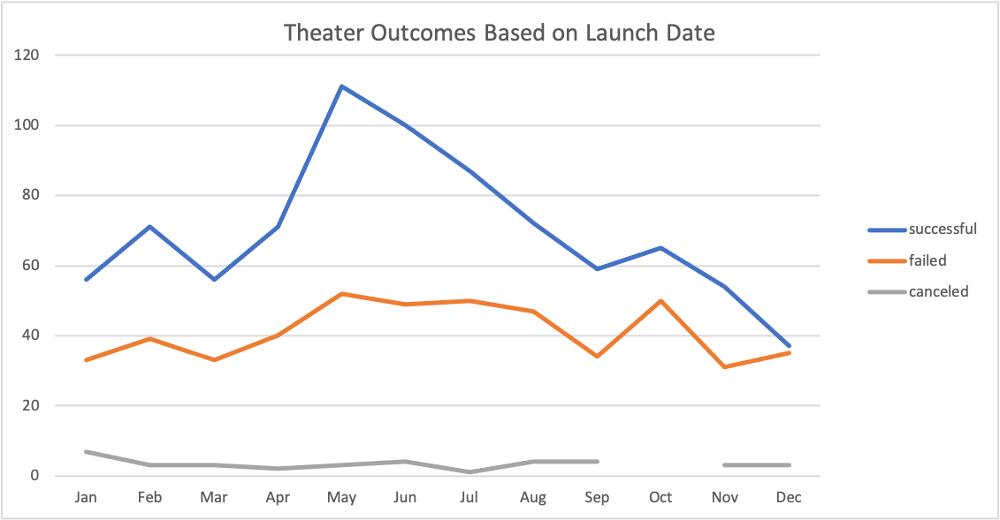
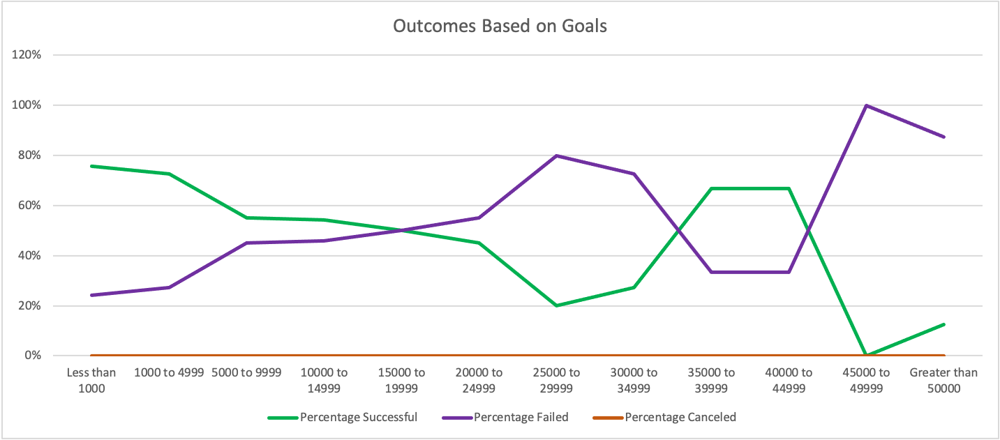

# Kickstarting with Excel

## Overview of Project

Our client, Louise, noticed that the play *Fever* raised money for its fundraising goal very quickly. She is interested to know how other theater campaigns handled reaching their goals based on launch dates and funding goals.

### Purpose

The purpose of these analyses is to determine whether different campaigns were successful or not in reaching their goals based on both their launch dates and funding goals. 

## Analysis and Challenges

### Analysis Based on Launch Date
Our first analysis was to determine theater campaign outcomes based on launch date. In order to figure out outcomes based on launch date I made a pivot table listing out months of the year, and displayed the number of successful, failed, and canceled campaigns in columns. Each month represents the launch date: the month that a campaign began raising money. On this pivot table, I was able to filter the Parent Category for theater and use the year filter to see any specific year. We then used this table to make a line chart, which makes it easy to see what launch dates had the highest success rates for theater campaigns.

### Analysis Based on Funding Goal
In the second analysis we were looking to discover the relationship between outcomes and funding goals. To do so, I made a pivot table with goal ranges in rows, and the outcomes in columns. I calculated the percentage of successful, failed, and canceled campaigns based on the funding goal. I made a line chart from the table with three lines showing the percentage of outcomes versus the funding goals. From the line chart we can easily see the outcome rates.

### Challenges and Difficulties
The most difficult part of the analysis was figuring out the countifs column in the funding goals versus the outcomes table. To determine the correct formula, I referenced a video provided in the course material, and posts on stackoverflow.com.

## Results

Based on our analysis, we can determine from our data that the most successful month to launch a theater campaign is May, as our line chart shows a spike in successes in this month.

We can also conclude that December is the least successful month to launch a theater campaign because the success and failed rates are almost the same, and the success rates are also lowest in December.

From the outcomes based on goals analysis, we can conclude that campaigns with funding goals ranging between $15,000 to $19,999 have a higher success rate than failure rate. Campaigns with funding goals about $19,999 have a failure rate higher than the success rate. There is a small range between $35,000 to $39,999 and $40,000 to $44,999 where theater campaigns have a higher success rate; however, after $44,999 the trend switches again.

Limitations of this dataset include having a small sample size and not having more research to compare our data to. In this analysis we are making conclusions about theater campaigns with only a small amount of data, and with more research our conclusions are likely to change.

Another graph we could make is length of campaign versus outcomes. This graph would show if the amount of time each campaign lasted changes the success rate of the campaign. It would benefit our client to determine whether a short or long campaign is better.

